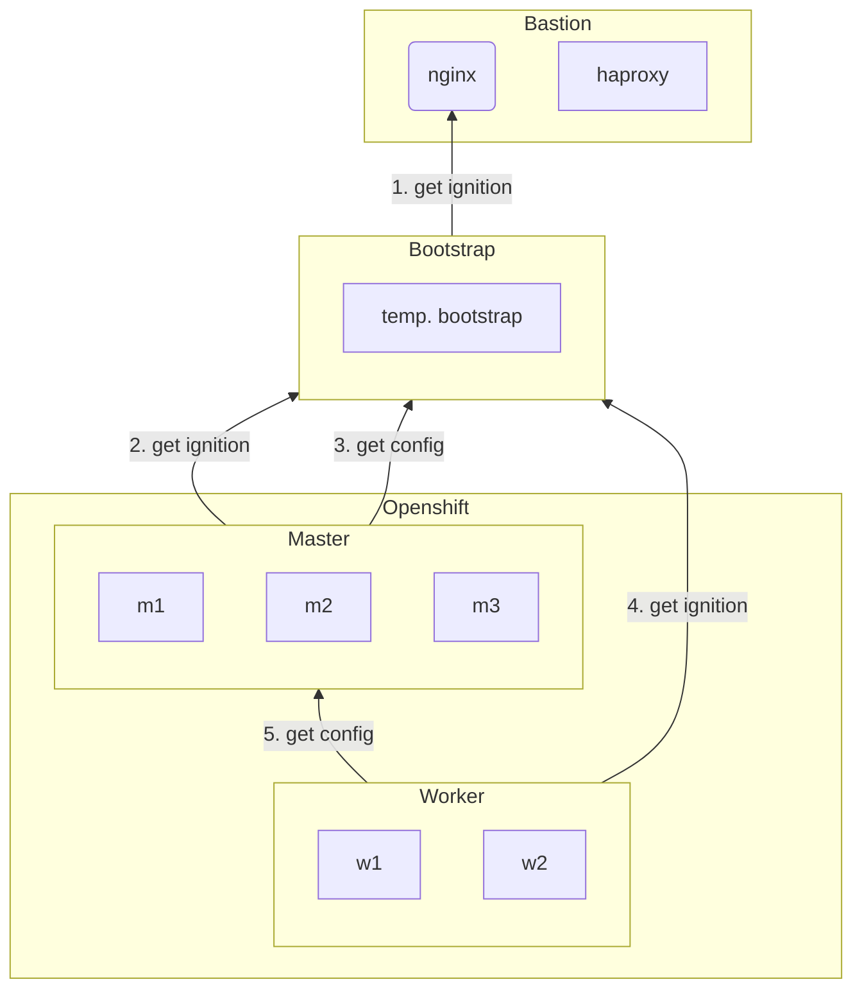
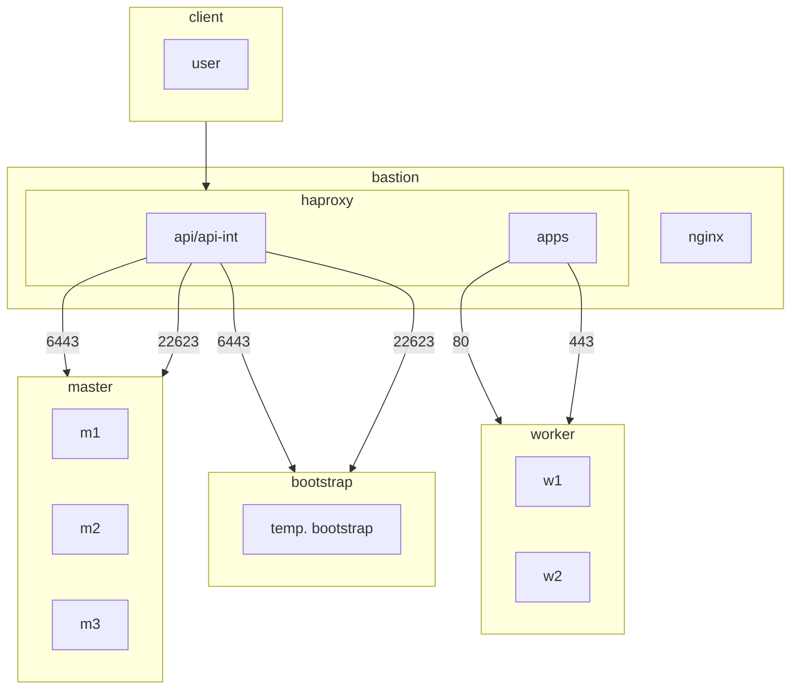

# OCP4 UPI Installation on vshpere
## Flowcharts
### Installation Flow

### Haproxy Config


## Installation Guide

## set password for ansible vault and install reqs
```

[root@bastion ocp4]#  echo ******* > pw
[root@bastion ocp4]#  ansible-galaxy collection install -r requirements.yml
 ```
 ## create ssh key if not present
 ```
[root@bastion ~]# ls ~/.ssh/id_rsa &> /dev/null || ssh-keygen -t rsa -q -N "" -f ~/.ssh/id_rsa &&  cat ~/.ssh/id_rsa.pub >> ~/.ssh/authorized_keys && chmod 600 ~/.ssh/authorized_keys
 ```
 
## prepare openshift with ansible playbook
```
[root@bastion ocp4]# ansible-playbook ocp4.yml   
 ```
 
 
## connect via oc to openshift cluster
```
[root@bastion openshift]# export KUBECONFIG=$(find /root -name kubeconfig )
[root@bastion openshift]# cp $(find /root -name oc) /usr/local/bin
[root@bastion openshift]# oc get nodes
 ```
 
## approve csr for each worker node twice
```
[root@bastion openshift]# oc get csr|awk '$NF=="Pending"{print $1}'|xargs oc adm certificate approve
 ```
 
## all nodes (worker and master should be ready)
```
[root@bastion openshift]# oc get nodes
 ```
## wait until all pods running and ready
```
[root@bastion openshift]# watch "oc get pods -A|grep -v Completed|egrep -v '([1-9])\/\1'"
```
